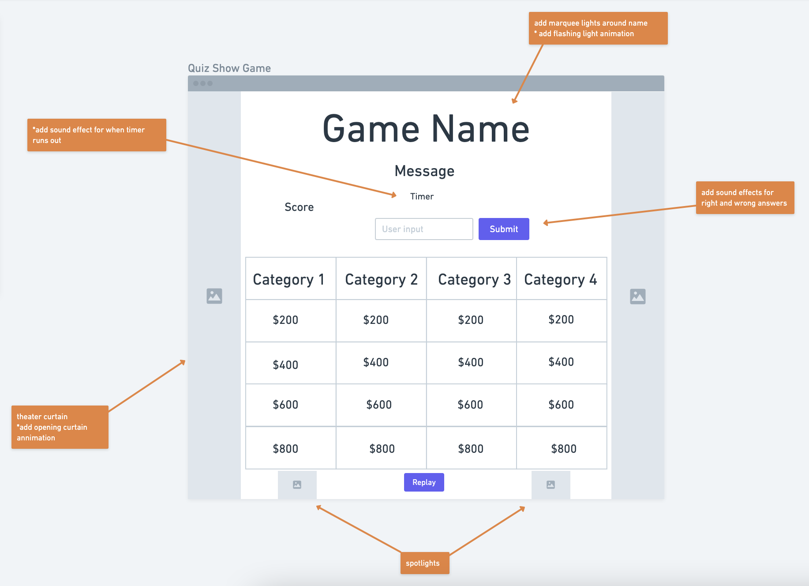
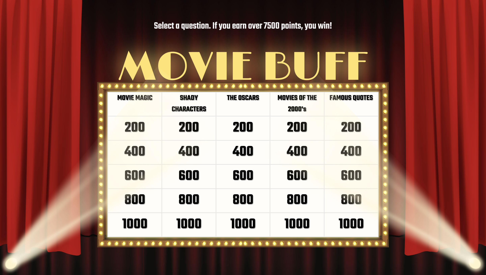

# Movie Buff
Movie Buff is a movie-themed quiz game inspired by Jeopardy! 

## Motivation  
I wanted to make this game becuase my family and I watch Jeopardy! together regularly, and my favorite categories are those related to film and tv. I took design inspiration from the old fashioned marquee at the movie theater in my town in addition to the originial Jeopardy! game board.

## Getting Started  
Click [here](https://movie-buff-unit-1-project.surge.sh/) to play.  

### Instructions
Select a question and enter your guess. Earn over 7500 points to win.  

Wireframe:
  

Starting game screen:

## Technologies Used  
  
  

## Credits  
[Questions](https://jeopardyquestions.com/)  
[Confetti](https://github.com/mathusummut/)  
[Audio](https://freesound.org/)  

## Next Steps  
- add a multi-player option
- add responsive design
- refresh the board with new questions when a new game starts  
- add light/ dark mode
- add applause audio on a win
- give the player a hint when their answer is incorrect 
- replace the question section with a modal
- add more styling and a label to the scoreboard